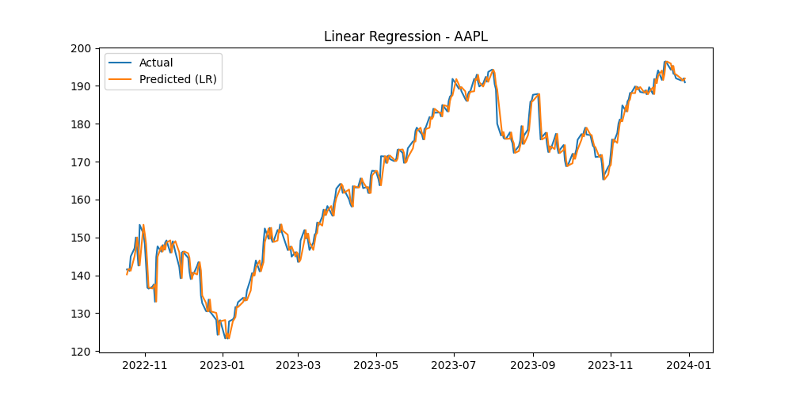
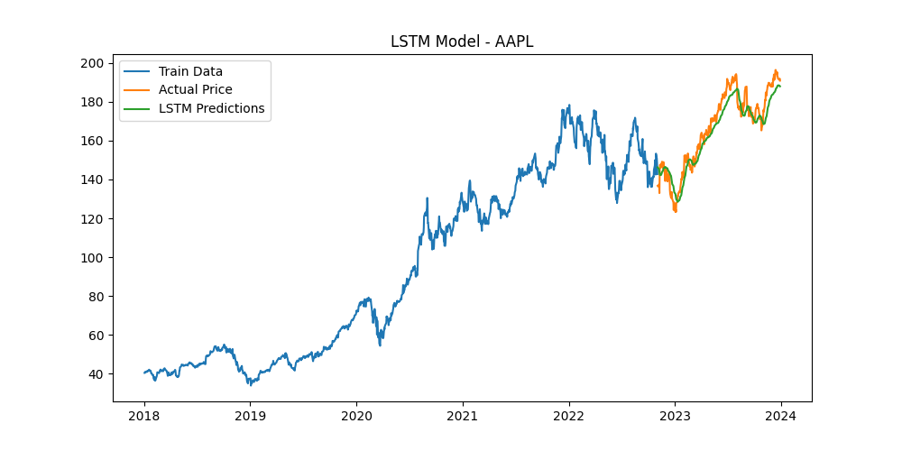
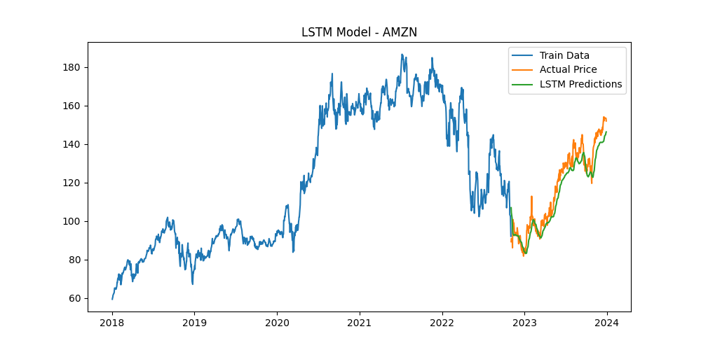
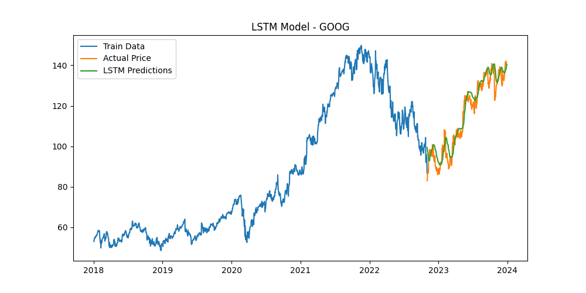
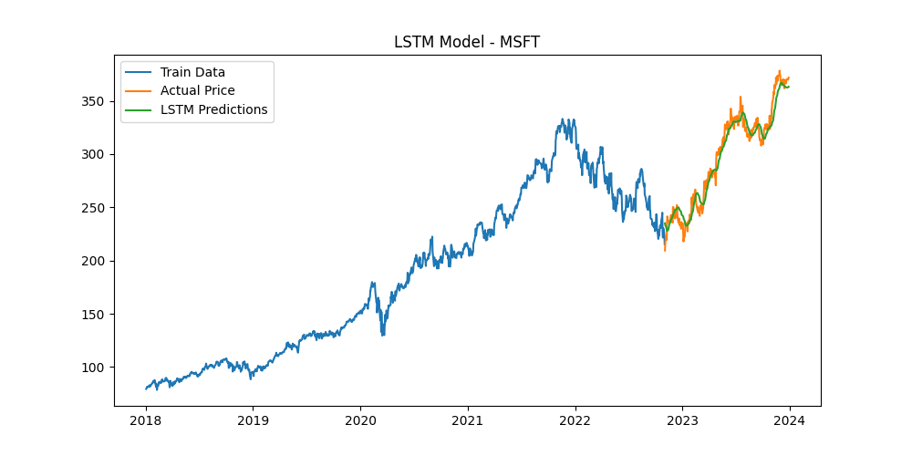

# Stock Price Prediction using Linear Regression and LSTM



## Overview
This project implements stock price prediction using two different machine learning approaches:
1. **Linear Regression** - A simple yet effective model for predicting stock prices based on previous day's closing price
2. **LSTM (Long Short-Term Memory)** - A deep learning approach that captures temporal dependencies in time series data

The project analyzes stock data for major tech companies including Apple (AAPL), Tesla (TSLA), Microsoft (MSFT), Google (GOOG), and Amazon (AMZN).

## Features
- Data collection using Yahoo Finance API (yfinance)
- Data preprocessing and feature engineering
- Implementation of Linear Regression model
- Implementation of LSTM neural network
- Model evaluation using R² Score and RMSE
- Visualization of actual vs predicted prices

## Requirements
- Python 3.7+
- pandas
- numpy
- scikit-learn
- tensorflow/keras
- yfinance
- matplotlib

## Installation
```bash
pip install pandas numpy scikit-learn tensorflow yfinance matplotlib
```

## Usage
1. Run the Jupyter notebook `Stock_Price_Prediction.ipynb`
2. The notebook will automatically:
   - Download historical stock data
   - Preprocess the data
   - Train both Linear Regression and LSTM models
   - Generate and save prediction visualizations

## Results
### LSTM Predictions

#### Apple (AAPL)


#### Amazon (AMZN)


#### Google (GOOG)


#### Microsoft (MSFT)


## Model Performance
The models are evaluated using:
- **R² Score**: Measures the proportion of variance in the dependent variable that's predictable from the independent variables
- **RMSE (Root Mean Square Error)**: Represents the square root of the average squared differences between predicted and actual values

## Future Improvements
- Add more technical indicators as features
- Implement ensemble methods
- Add sentiment analysis from news articles
- Create a web interface for real-time predictions

## License
This project is open source and available under the [MIT License](LICENSE).

## Acknowledgments
- Data provided by [Yahoo Finance](https://finance.yahoo.com/)
- Built with Python's data science stack
